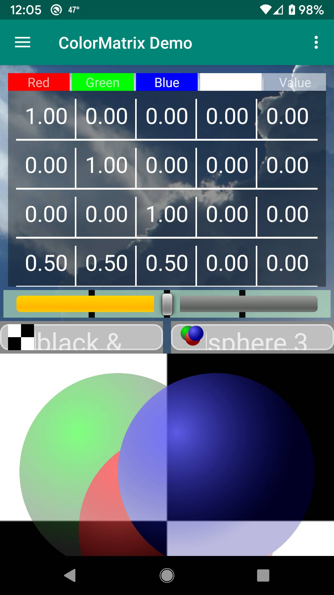
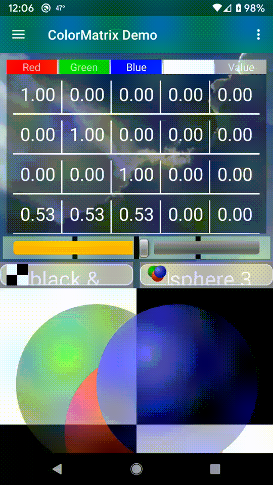
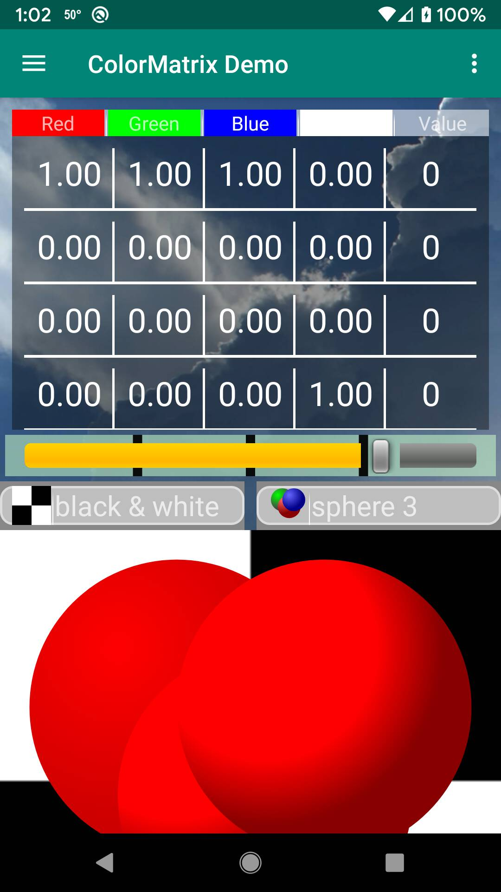
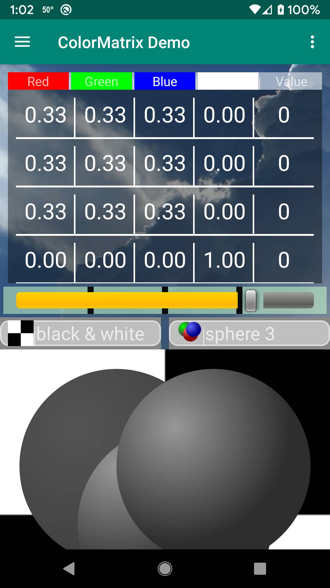
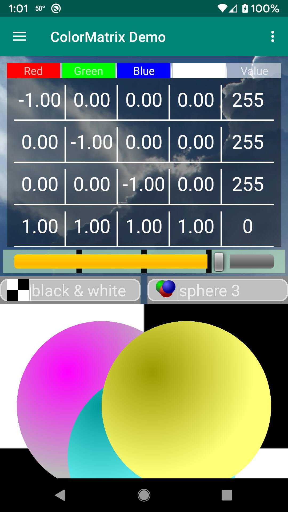

# LanDen Labs - ColorMatrix
Android ColorMatrix
<br>18-Apr-2026
<br>API 36 AndroidX Java
<br>[Home website](https://landenlabs.com/android/index.html)


**Demonstrate Android ColorMatrix and ColorMatrixColorFilter**

[](https://travis-ci.org/landenlabs/all-colormatrix)
[](https://snyk.io/test/github/landenlabs/all-colormatrix)
[](LICENSE)

## Web Links
* [webpage](https://landenlabs.com/android/all-colormatrix/index.html) for detailed information.
* [See use of colorMatrix in all-uitest app](http://github.com/landenlabs/all-uitest) 
* [C# color matrix program](https://landenlabs.com/cs-colormatrix/colormatrix.html)
* [C# program posted to Code Project](https://www.codeproject.com/Articles/75006/Color-Matrix-Image-Drawing-Effects)
* [Home webpage](https://landenlabs.com/android/index.html) for more information.


## Intro
<a name="page1"></a>
**Intro Screen** 



[To Top](#table)


## Example using app



[To Top](#table)

**Red Filters** 



[To Top](#table)

## Gray Filter



[To Top](#table)

## Invert Filters



[To Top](#table)


### License

```
Copyright 2026 Dennis Lang (LanDen Labs)

Licensed under the Apache License, Version 2.0 (the "License");
you may not use this file except in compliance with the License.
You may obtain a copy of the License at

 http://www.apache.org/licenses/LICENSE-2.0
Unless required by applicable law or agreed to in writing, software
distributed under the License is distributed on an "AS IS" BASIS,
WITHOUT WARRANTIES OR CONDITIONS OF ANY KIND, either express or implied.
See the License for the specific language governing permissions and
limitations under the License.
```
See [LICENSE](LICENSE) for the full license text.

[To Top](#table)
<br>[Home website](https://landenlabs.com/android/index.html)
